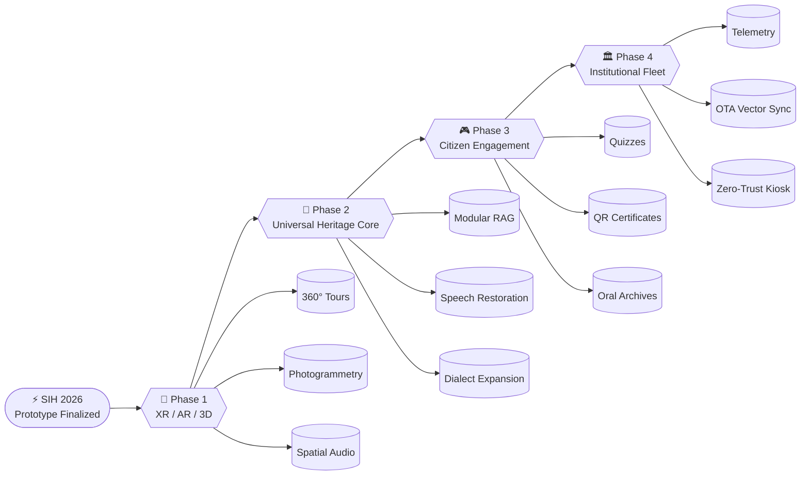
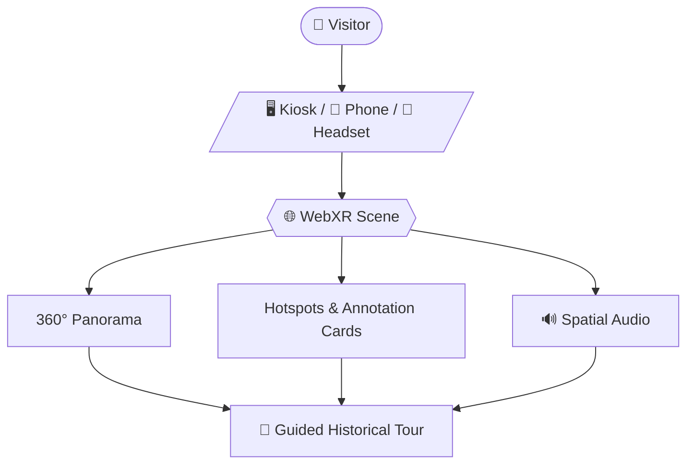
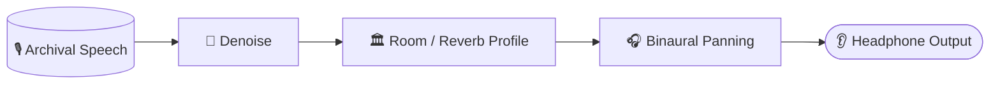
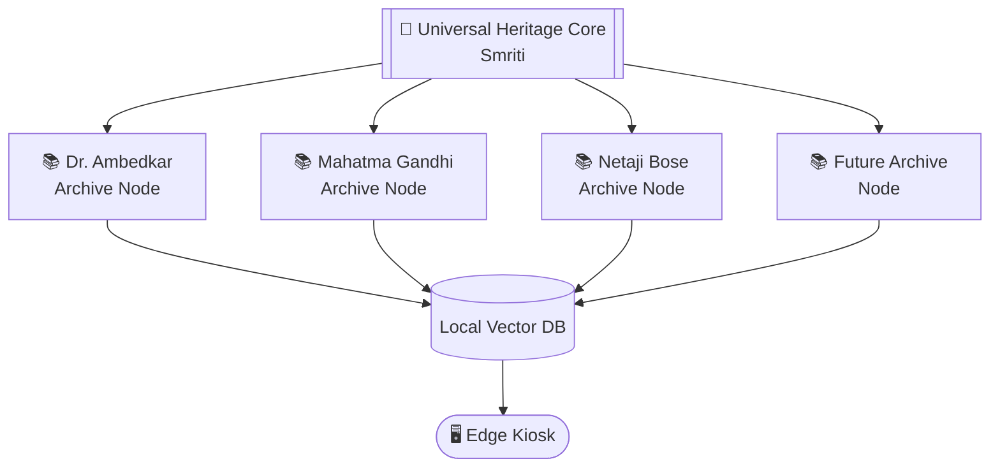
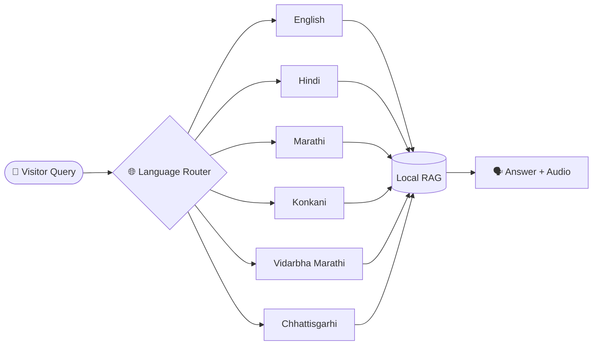
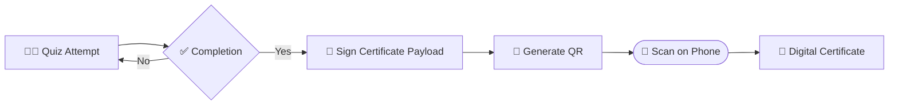
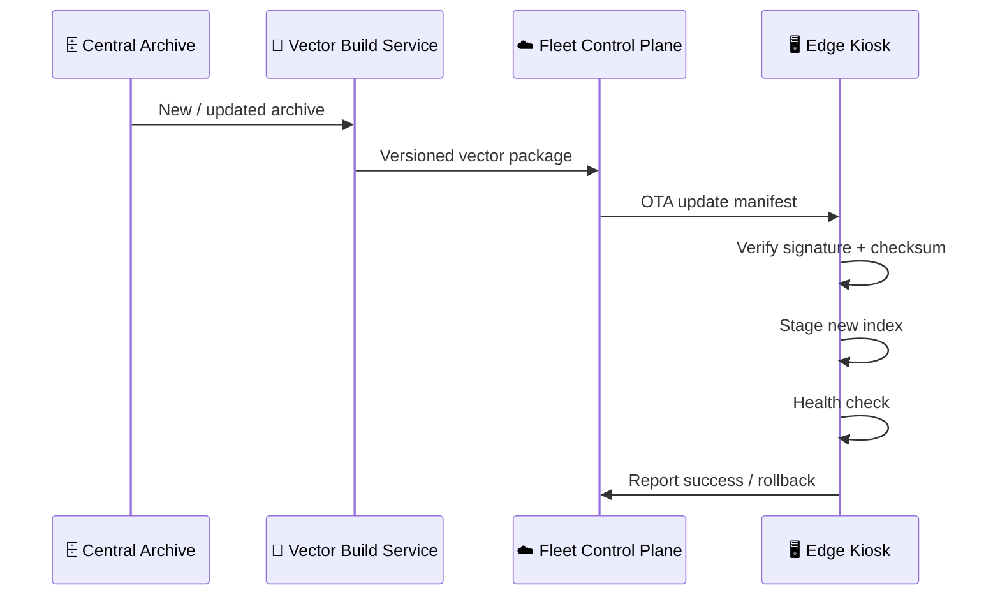
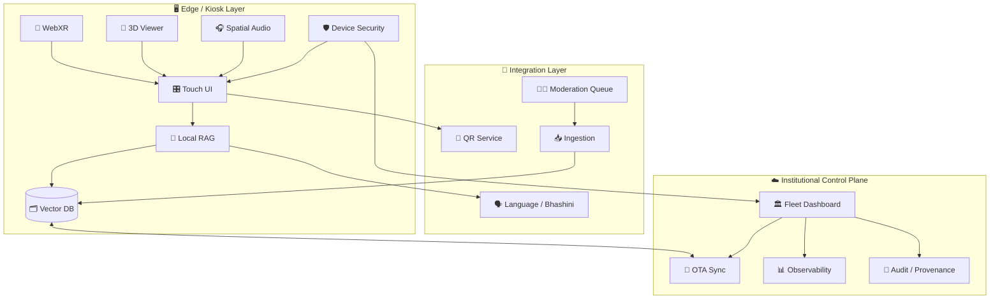
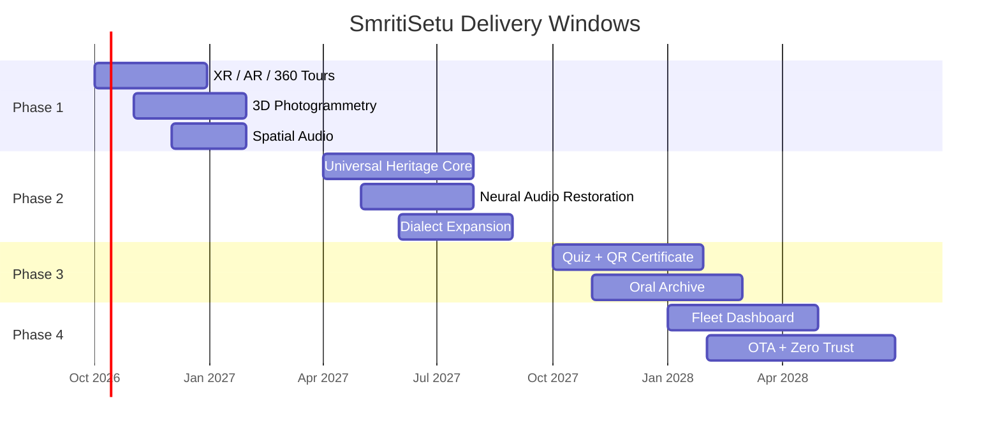

# ⚡ SmritiSetu Digital Archive Project

> **SIH 2026 Prototype Finalized**  •  **Phase 1:** WebXR 360° Hall & 3D Photogrammetry  •  **Phase 2:** 1940s AI Speech Restoration  •  **Phase 3:** Central MoSJE Fleet OTA Dashboard

<div align="center">


**Powered by Open-Source AI & Edge Hardware**

`XR + RAG + Speech AI + Edge Computing + OTA + Civic Learning`

</div>

---

## 🧭 Strategic Overview & Milestones

| 🥽 **Phase 1 — XR & AR** | 🧠 **Phase 2 — Universal Engine** | 🏛️ **Phase 3 — Fleet & Gamification** |
|---|---|---|
| **Timeline:** Q4 2026 → Q1 2027 | **Timeline:** Q2 2027 → Q3 2027 | **Timeline:** Q4 2027 → Q2 2028 |
| **Progress:** `███████░░░░░░░░░░░` **35%** | **Progress:** `██░░░░░░░░░░░░░░░░░` **10%** | **Status:** 💤 Planned |

### 🌀 Roadmap at a Glance



---

# 🥽 Phase 1 — Immersive Visuals & WebXR/AR Integration

**Months 1–6 · Q4 2026 → Q1 2027**

> **Mission:** Transform static archival content into immersive, spatial, touch-first experiences that work on kiosks, phones, and XR headsets.

## 🏰 1. WebXR 360° Historical Tours

**Technology:** `Three.js` · `WebXR` · `A-Frame`

Allows visitors to virtually step inside historical landmarks — for example, a **1949 Constituent Assembly setting** or the **Mahad Satyagraha site** — using screen touch, mouse/keyboard controls, or a headset.


> 📷 Historical reference image: *First day of the Constituent Assembly of India, 11 December 1946.* Source and licensing information: [Wikimedia Commons](https://commons.wikimedia.org/wiki/File:Indian_Constituent_Assembly.JPG).

### 🎛️ Experience Flow



## 👓 2. 3D Artifact Photogrammetry

**Technology:** `GLTF/GLB` · `Babylon.js`

Create high-fidelity **3D digital twins** of documented artifacts such as spectacles, fountain pens, manuscripts, and archival objects. Visitors can rotate, zoom, inspect, and open contextual overlays.

```text
             ┌───────────────────────────────┐
             │        📦 SOURCE ARTIFACT      │
             └───────────────┬───────────────┘
                             │
                     📸 Multi-angle Capture
                             │
                             ▼
             ┌───────────────────────────────┐
             │   🧩 Photogrammetry Pipeline  │
             │   Mesh + Texture + Metadata   │
             └───────────────┬───────────────┘
                             │
                      GLTF / GLB Export
                             │
                             ▼
             ┌───────────────────────────────┐
             │ 🥽 Babylon.js Viewer          │
             │ ↻ Rotate  🔍 Zoom  ℹ️ Inspect │
             └───────────────────────────────┘
```

## 🎧 3. Spatial Audio Simulation

**Technology:** `Web Audio API` · `Binaural Panning`

Upgrade **Headphone 2** output to emulate realistic room acoustics of historic parliamentary debates, public meetings, and rallies.



### 🌀 Phase 1 Visual Progress

<div style="font-family:system-ui;max-width:720px">
  <div style="display:flex;justify-content:space-between;font-weight:700">
    <span>Phase 1</span><span>35%</span>
  </div>
  <div style="height:14px;border:1px solid #888;border-radius:999px;overflow:hidden;background:#eee">
    <div style="height:100%;width:35%;background:linear-gradient(90deg,#6d28d9,#2563eb,#06b6d4);animation:smritiPulse 2.2s ease-in-out infinite alternate"></div>
  </div>
</div>

---

# 🧠 Phase 2 — Universal “Multi-Personality” Heritage Engine

**Months 6–12 · Q2 2027 → Q3 2027**

> **Mission:** Separate the platform core from individual archival identities so the same software can power multiple heritage experiences.

## 🧬 Universal Heritage Core — “Smriti”



### 🔄 Modular RAG Reskinning

Decouple the software core so museum staff can upload **PDF archives** of other national figures or curated collections and generate localized AI kiosk experiences.

**Pipeline:**

`PDF / Scan → OCR & Parsing → Chunking → Embeddings → Vector Index → RAG → Guardrails → Kiosk UI`

### 🎙️ Neural Audio Restoration

Apply deep-learning restoration models such as **denoising / enhancement networks** to reduce hiss, static, broadband noise, and other recording artifacts in historical speech material, while retaining the provenance of the original recording.

> ⚠️ **Archive integrity rule:** Always preserve the untouched source recording alongside any enhanced version, and label generated/restored audio as processed.

### 🗣️ Sub-Regional Dialect Expansion

Integrate `Bhashini API` modules and a pluggable language layer for regional accessibility, including examples such as **Konkani, Vidarbha Marathi, and Chhattisgarhi**.




> 📷 Historical reference image: *Mahatma Gandhi in the 1920s.* Source and licensing information: [Wikimedia Commons](https://commons.wikimedia.org/wiki/File:Gandhi.jpg).


> 📷 Historical reference image: *Subhas Chandra Bose.* Source and licensing information: [Wikimedia Commons](https://commons.wikimedia.org/wiki/File:Subhas_Chandra_Bose.jpg).

---

# 🎮 Phase 3 — Citizen Engagement & Gamification

**Months 12–18 · Q4 2027 → Q2 2028**

## 📜 Constitutional Literacy Quizzes

Interactive **3-minute quizzes** on touchscreen terminals to encourage exploration of constitutional concepts and archival context among student visitors.

**Suggested interaction loop:**

`Learn → Answer → Instant Feedback → Explore Source → Retry → Complete`

### 🏅 Instant QR E-Certificates

Users scan an on-screen **QR code** after quiz completion to receive a co-branded digital certificate on their smartphone or through an appropriate document wallet / repository integration.



## 🎙️ Crowdsourced Oral Archives

A moderated **Voice Record** kiosk lets community elders and local historians record personal memories. Submissions enter an archival review queue before publication.

```text
🎙️ Record
   ↓
📝 Consent + Metadata
   ↓
🧹 Quality Check
   ↓
👥 Human Moderation
   ↓
🏷️ Archive / Tag / Transcribe
   ↓
🌐 Publish (Approved Items Only)
```

---

# 🏛️ Phase 4 — National Institutional Fleet Management

**Months 18+ · Scaled rollout**

## 📊 MoSJE Central Dashboard

A cloud administration panel for operational monitoring across deployed kiosk nodes.

### Example telemetry surface

| Telemetry | Purpose | Suggested cadence |
|---|---|---|
| 🌡️ CPU thermals | Detect thermal stress | Near-real-time |
| ⏱️ Kiosk uptime | Reliability tracking | Near-real-time |
| 💾 Storage | Capacity / cleanup planning | Periodic |
| 📶 Connectivity | Network health | Near-real-time |
| 🔎 Popular queries | Content discovery patterns | Aggregated |
| 🧩 App version | Fleet consistency | On heartbeat |
| 🛡️ Security state | Device integrity | On heartbeat |

## 🔄 Over-the-Air Vector Sync

Push newly digitized archival records and updated **vector-database indices** to edge kiosks without manual installation at every location.



## 🛡️ Zero-Trust Kiosk Lock

Use hardware-backed device identity and operating-system kiosk controls to reduce tampering and unauthorized access in public spaces.

**Security building blocks:**

`TPM-backed identity` · `Secure Boot` · `App Allowlisting` · `Full-screen Kiosk Mode` · `Signed OTA Packages` · `Encrypted Local Storage` · `Least Privilege` · `Audit Logs`

---

# 🗺️ End-to-End System Architecture



---

# 📈 Projected Metrics & Impact Goals

## 🚀 Rollout Targets

```text
2026  ████████░░░░░░░░░░░░  20 Kiosks
      Pilot phase in metropolitan museums

2027  ██████████████░░░░░░  100+ Kiosks
      State libraries & educational hubs

2028  ████████████████████  500+ Kiosks
      Nationwide digital heritage network
```

### 🎯 Target Metrics

| Metric | Goal | Indicator |
|---|---:|---|
| 👥 Citizen interactions | **1,000,000+** by Q4 2027 | Reach |
| ⚡ Local RAG retrieval | **< 700 ms** | Performance target |
| 📴 Offline reliability | **99.9% uptime target** | Edge resilience |
| 🖥️ 2026 pilot fleet | **20 kiosks** | Initial deployment |
| 🌐 2027 network | **100+ kiosks** | Expansion |
| 🇮🇳 2028 network | **500+ kiosks** | Nationwide scale |

### 📊 Animated KPI Meter

<div style="display:grid;gap:12px;max-width:760px">
  <div>
    <strong>👥 Engagement target</strong>
    <div style="height:12px;border:1px solid #888;border-radius:999px;overflow:hidden;background:#eee;margin-top:5px">
      <div style="height:100%;width:78%;background:linear-gradient(90deg,#16a34a,#0ea5e9);animation:smritiShimmer 2.5s linear infinite"></div>
    </div>
  </div>
  <div>
    <strong>⚡ Retrieval target</strong>
    <div style="height:12px;border:1px solid #888;border-radius:999px;overflow:hidden;background:#eee;margin-top:5px">
      <div style="height:100%;width:88%;background:linear-gradient(90deg,#f59e0b,#ef4444);animation:smritiShimmer 2.1s linear infinite"></div>
    </div>
  </div>
  <div>
    <strong>🖥️ Scale target</strong>
    <div style="height:12px;border:1px solid #888;border-radius:999px;overflow:hidden;background:#eee;margin-top:5px">
      <div style="height:100%;width:100%;background:linear-gradient(90deg,#7c3aed,#ec4899);animation:smritiShimmer 1.8s linear infinite"></div>
    </div>
  </div>
</div>

---

# 🧩 Recommended Module Map

| Module | Core responsibility | Primary layer |
|---|---|---|
| 🥽 **XR Tour Engine** | 360° historical spaces | Experience |
| 🧊 **Artifact Viewer** | 3D digital twins | Experience |
| 🎧 **Audio Engine** | Spatial / restored audio | Media |
| 🧠 **Heritage Core** | RAG + archive-aware response | AI |
| 🗣️ **Language Layer** | Regional language access | AI / Integration |
| 🎮 **Learning Loop** | Quizzes + certificates | Engagement |
| 🎙️ **Oral Archive** | Moderated community recordings | Archive |
| 🏛️ **Fleet Control** | Device management | Operations |
| 🔄 **OTA Pipeline** | Versioned content/index rollout | Operations |
| 🛡️ **Zero-Trust Stack** | Device hardening | Security |

---

# ✅ Delivery Gates



---

# 🧪 Prototype Acceptance Checklist

- [ ] 🥽 360° scene loads locally on kiosk hardware
- [ ] 🧊 GLTF/GLB artifact renders with rotate/zoom controls
- [ ] 🎧 Spatial-audio mode works with supported headphones
- [ ] 🧠 RAG answers are grounded in approved local archives
- [ ] 🔎 Source / provenance is visible for archival responses
- [ ] 🎙️ Restored audio is labelled as processed and preserves the original
- [ ] 🗣️ Language routing supports the selected regional language set
- [ ] 🎮 Quiz completion state is robust to refresh/restart
- [ ] 🔲 QR certificate payload is signed / verifiable
- [ ] 🎙️ Voice submissions require consent + moderation
- [ ] 📊 Fleet dashboard receives heartbeat telemetry
- [ ] 🔄 OTA package is signed, versioned, and rollback-capable
- [ ] 🛡️ Kiosk boots into locked public-user mode
- [ ] 📴 Core visitor experience remains usable without internet access

---

# 🖼️ Historical Visual References

<table>
<tr>
<td align="center" width="33%">
<br>
<strong>Dr. B. R. Ambedkar</strong><br>
<a href="https://commons.wikimedia.org/wiki/File:Dr._B._R._Ambedkar.jpg">Wikimedia Commons</a>
</td>
<td align="center" width="33%">
<br>
<strong>Constituent Assembly</strong><br>
<a href="https://commons.wikimedia.org/wiki/File:Indian_Constituent_Assembly.JPG">Wikimedia Commons</a>
</td>
<td align="center" width="33%">
<br>
<strong>Mahad Satyagraha</strong><br>
<a href="https://commons.wikimedia.org/wiki/File:Reception_Committee_for_Mahad_Satyagraha.jpg">Wikimedia Commons</a>
</td>
</tr>
</table>

### 🎞️ Animated archival element


> The image above is an archival GIF hosted on Wikimedia Commons. See the file page for provenance and licensing details: [Young Ambedkar.gif](https://commons.wikimedia.org/wiki/File:Young_Ambedkar.gif).

---

# 🎨 Icon & Shape Legend

| Symbol | Meaning |
|---|---|
| 🥽 | XR / immersive experience |
| 🧊 | 3D / photogrammetry |
| 🎧 | Audio / spatial sound |
| 🧠 | AI / RAG / inference |
| 🗣️ | Language / speech |
| 🎮 | Gamification / learning |
| 🎙️ | Oral archive / voice capture |
| 🏛️ | Institutional / government operations |
| 🔄 | Synchronization / OTA |
| 🛡️ | Security / trust |
| 🖥️ | Kiosk / edge device |
| ☁️ | Central cloud control plane |
| `([…])` | Mermaid process / entry or exit |
| `[[…]]` | Mermaid core system |
| `{…}` | Mermaid decision point |
| `[(…)]` | Mermaid datastore |

---

# 🧱 Renderer Notes

This Markdown intentionally combines **standard Markdown**, **Mermaid**, and **HTML** so it can present richer UI in renderers that support them.

- ✅ Standard Markdown: portable almost everywhere.
- ✅ Mermaid: supported by many documentation platforms and modern Markdown viewers.
- ✅ HTML tables/images: commonly supported in GitHub-style renderers.
- ✨ Inline CSS animations: render where the Markdown host permits `<style>` / inline styling. Static content remains readable when animation is disabled.
- ♿ Respect `prefers-reduced-motion` in production UI implementations.

### Optional CSS for hosts that permit a `<style>` block

```html
<style>
@keyframes smritiPulse {
  from { transform: translateX(-2px); opacity: .82; }
  to   { transform: translateX(2px); opacity: 1; }
}

@keyframes smritiShimmer {
  0%   { filter: brightness(0.92); }
  50%  { filter: brightness(1.08); }
  100% { filter: brightness(0.92); }
}

@media (prefers-reduced-motion: reduce) {
  * { animation: none !important; scroll-behavior: auto !important; }
}
</style>
```

---

# 📌 Project Identity

**SmritiSetu Digital Archive Project**  
**Theme:** Digital Heritage · Inclusive AI · Edge XR · Archival Preservation · Citizen Learning

> **From archive → experience → understanding → participation.**

---

## 🔗 Image Sources & Licensing References

- [Dr. B. R. Ambedkar — Wikimedia Commons](https://commons.wikimedia.org/wiki/File:Dr._B._R._Ambedkar.jpg)
- [Indian Constituent Assembly — Wikimedia Commons](https://commons.wikimedia.org/wiki/File:Indian_Constituent_Assembly.JPG)
- [Reception Committee for Mahad Satyagraha — Wikimedia Commons](https://commons.wikimedia.org/wiki/File:Reception_Committee_for_Mahad_Satyagraha.jpg)
- [Gandhi — Wikimedia Commons](https://commons.wikimedia.org/wiki/File:Gandhi.jpg)
- [Subhas Chandra Bose — Wikimedia Commons](https://commons.wikimedia.org/wiki/File:Subhas_Chandra_Bose.jpg)
- [Young Ambedkar.gif — Wikimedia Commons](https://commons.wikimedia.org/wiki/File:Young_Ambedkar.gif)

> **Licensing reminder:** Wikimedia Commons files can have different licenses. Verify the current license and attribution requirements on each file page before redistributing the Markdown or publishing the embedded media as part of a production website/app.
